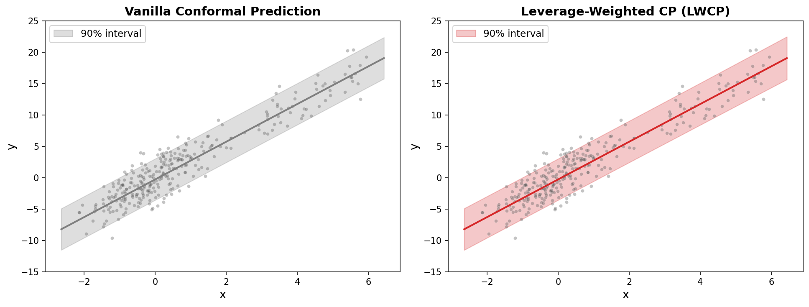

# LWCP: Leverage-Weighted Conformal Prediction

Prediction intervals that adapt to statistical leverage. High-leverage points
(far from the training centroid) receive wider intervals; low-leverage points
receive narrower intervals. The result is tighter intervals on average while
preserving both marginal and approximate conditional coverage.

**Paper:** *Leverage-Weighted Conformal Prediction*, Fadnavis (2026).

## Installation

```bash
pip install -e .
```

To run the experiments and reproduce paper figures:

```bash
pip install -e ".[experiments]"
```

### Requirements

- Python >= 3.10
- NumPy >= 1.24
- SciPy >= 1.10
- scikit-learn >= 1.3
- matplotlib >= 3.7 (experiments only)
- quantile-forest >= 1.3 (experiments only)

## Example

Vanilla conformal prediction uses constant-width intervals for every test point.
LWCP adapts: narrower where a test point is near the training data (low leverage),
wider where it is far away (high leverage).



```python
import numpy as np
import matplotlib.pyplot as plt
from sklearn.linear_model import Ridge
from lwcp import LWCP, ConstantWeight

# 30 features, mix of normal + high-leverage points
rng = np.random.default_rng(5)
p, n = 30, 200
X = rng.standard_normal((n, p))
X[-20:] *= 3  # 20 high-leverage points far from centroid

beta = rng.standard_normal(p) * 0.5
y = X @ beta + rng.normal(0, 2.0, size=n)

# Fit LWCP and Vanilla CP
model = LWCP(predictor=Ridge(alpha=1.0), alpha=0.1, random_state=0)
model.fit(X, y)
vanilla = LWCP(predictor=Ridge(alpha=1.0), alpha=0.1, random_state=0,
               weight_fn=ConstantWeight())
vanilla.fit(X, y)

# Test on low + high leverage points
X_test = np.vstack([rng.standard_normal((150, p)),
                    rng.standard_normal((150, p)) * 3])
_, lo, hi = model.predict(X_test)
_, lo_v, hi_v = vanilla.predict(X_test)

h = model.leverage_computer_.leverage_scores(X_test)
w_lwcp, w_vanilla = hi - lo, hi_v - lo_v

# Right panel: width vs leverage
fig, ax = plt.subplots(figsize=(8, 5))
ax.scatter(h, w_vanilla, alpha=0.5, s=25, color="#7f7f7f", label="Vanilla CP")
ax.scatter(h, w_lwcp, alpha=0.5, s=25, color="#d62728", label="LWCP")
ax.set_xlabel("Leverage score h(x)")
ax.set_ylabel("Interval width")
ax.set_title("Width Adapts to Leverage")
ax.legend()
plt.show()
```

## Quick Start

```python
from sklearn.linear_model import LinearRegression
from lwcp import LWCP

model = LWCP(
    predictor=LinearRegression(),
    alpha=0.1,  # 90% coverage
)
model.fit(X, y)
y_pred, lower, upper = model.predict(X_test)
```

### With a pre-computed train/calibration split

```python
model = LWCP(predictor=LinearRegression(), alpha=0.1)
model.fit_with_precomputed_split(X_train, y_train, X_cal, y_cal)
y_pred, lower, upper = model.predict(X_test)
```

### Automatic weight selection

```python
model = LWCP(predictor=LinearRegression(), weight_fn="auto", alpha=0.1)
model.fit(X, y)
```

### Approximate leverage (for large p)

```python
model = LWCP(
    predictor=LinearRegression(),
    leverage_method="approximate",
    n_components=15,  # rank-k truncated SVD
    alpha=0.1,
)
model.fit(X, y)
```

### Diagnostics

```python
from lwcp import diagnose_weight_alignment

result = diagnose_weight_alignment(
    model.calibration_scores_,
    model.calibration_leverages_,
)
print(result.recommendation)  # "use LWCP", "use vanilla", or "inconclusive"
print(f"eta_hat = {result.eta_hat:.3f}")  # leverage variation coefficient
```

## API Reference

### Core

| Class | Description |
|---|---|
| `LWCP` | Main class. scikit-learn `BaseEstimator` API with `fit` / `predict`. |
| `LeverageComputer` | Computes leverage scores via SVD (exact or randomized). |
| `FeatureSpaceLeverageComputer` | Leverage in a learned feature space (e.g., neural net penultimate layer). |

### Weight Functions

| Class | Formula | Use case |
|---|---|---|
| `InverseRootLeverageWeight` | `(1 + h)^{-1/2}` | Default. Optimal under homoscedastic noise. |
| `PowerLawWeight` | `(1 + h)^{-gamma}` | Tunable exponent for heteroscedastic noise. |
| `ConstantWeight` | `1` | Equivalent to vanilla (unweighted) conformal prediction. |
| `WeightSelector` | Validation-based | Selects the best weight from a candidate set. |

### Diagnostics

| Function | Description |
|---|---|
| `diagnose_weight_alignment` | Tests whether LWCP weights are well-aligned with heteroscedasticity. Returns recommendation, leverage variation coefficient (eta_hat), and regression statistics. |

## Reproducing Paper Figures

All 13 figures from the paper can be reproduced with:

```bash
python -m experiments.run_all
```

This runs all 14 experiments and saves figures to `experiments/figures/`. For a
quick sanity check with fewer Monte Carlo repetitions:

```bash
python -m experiments.run_all --quick
```

### Individual experiments

| Figure | Script | Description |
|---|---|---|
| Fig 1 | `python -m experiments.run_conditional` | Conditional coverage by leverage decile |
| Fig 2 | `python -m experiments.run_baselines` | Baselines comparison (CQR, Studentized CP) |
| Fig 3 | `python -m experiments.run_gaussian_recovery` | Gaussian oracle width recovery |
| Fig 4 | `python -m experiments.run_hetero_sweep` | Heteroscedasticity sweep |
| Fig 5 | `python -m experiments.run_width` | Width vs leverage scatter |
| Fig 6 | `python -m experiments.run_scaling` | Scaling heatmap and gap vs n |
| Fig 7-8 | `python -m experiments.regenerate_fig7_fig8` | Approximate leverage coverage and scatter |
| Fig 9 | `python -m experiments.run_real_data` | Real datasets (Diabetes, CPU, Superconductor) |
| Fig 10 | `python -m experiments.run_ridge` | Ridge leverage |
| Fig 11 | `python -m experiments.run_coverage` | Marginal coverage (1000 reps) |
| Fig 12 | `python -m experiments.run_nonlinear` | Non-linear predictors |

### Data sources

- **Diabetes**: `sklearn.datasets.load_diabetes()` (built-in)
- **CPU Activity**: OpenML dataset 562
- **Superconductor**: OpenML dataset 44065

All datasets are downloaded automatically on first run.

## Running Tests

```bash
pytest tests/ -v
```

## Project Structure

```
lwcp/
    __init__.py          # Public API exports
    conformal.py         # LWCP class (fit / predict)
    leverage.py          # Leverage score computation (exact / approximate SVD)
    weights.py           # Weight functions and automatic selection
    diagnostics.py       # Weight alignment diagnostic
    _utils.py            # Conformal quantile helper

experiments/
    run_all.py           # Master script (runs all experiments)
    run_*.py             # Individual experiment scripts
    dgps.py              # Data generating processes
    baselines.py         # Baseline methods (Vanilla CP, CQR, Studentized, LWCP+)
    plotting.py          # Publication-quality matplotlib style
    metrics.py           # MSCE and WSC evaluation metrics
    results/             # Saved JSON results
    figures/             # Generated PDF and PNG figures

tests/
    test_conformal.py    # LWCP class tests
    test_leverage.py     # Leverage computation tests
    test_weights.py      # Weight function tests
    test_integration.py  # End-to-end integration tests
```

## Citation

```bibtex
@article{fadnavis2026lwcp,
  author  = {Fadnavis, Shreyas},
  title   = {Leverage-Weighted Conformal Prediction},
  year    = {2026}
}
```

## License

MIT
